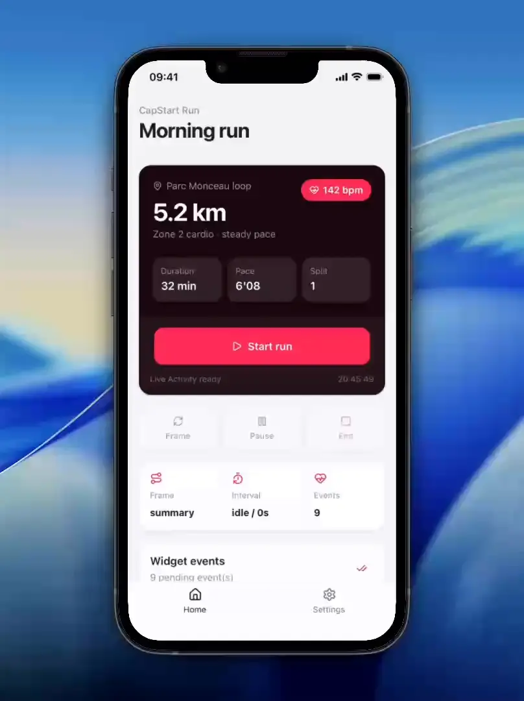

# @capgo/capacitor-widget-kit
<a href="https://capgo.app/"></a>

<div align="center">
  <h2><a href="https://capgo.app/?ref=plugin_widget_kit"> ➡️ Get Instant updates for your App with Capgo</a></h2>
  <h2><a href="https://capgo.app/consulting/?ref=plugin_widget_kit"> Missing a feature? We’ll build the plugin for you 💪</a></h2>
</div>

Create WidgetKit, ActivityKit, and Android widget experiences from Capacitor without forcing one rendering model.

## Demo



The plugin has two implementation paths:

- SVG template activities: store SVG layouts, optional named frames, hotspots, declarative state patches, pause/resume timers, and interaction events. Use this when your widget can be driven by resolved SVG output.
- Full-native widget sessions: store shared JSON state for native widget code and queue app-to-widget or widget-to-app messages. Use this when you want to render the widget fully in Swift/Kotlin/Java but still need Capacitor to start, stop, sync, or process async work.

The included workout flow is only an example helper built on top of the generic SVG abstraction.

## Install

```bash
bun add file:../capacitor-widget-kit
bunx cap sync ios
bunx cap sync android
```

## iOS Requirements

- iOS 17+ is recommended for interactive Live Activity buttons.
- Add `NSSupportsLiveActivities` to the app `Info.plist` when using ActivityKit.
- Add the same App Group to the app target and the widget extension target.
- Set `CapgoWidgetKitAppGroup` in both `Info.plist` files to the shared App Group identifier.

Example App Group:

```xml
<key>CapgoWidgetKitAppGroup</key>
<string>group.app.capgo.widgetkit.exampleapp.widgetkit</string>
```

## Native Widget Code

The plugin ships the native pieces a widget extension or Android widget can use:

- `CapgoTemplateActivityAttributes` for the iOS Live Activity bridge
- `CapgoTemplateActionIntent` for interactive iOS template buttons
- `CapgoTemplateWidgetBridge` to load a stored SVG activity and resolve one surface into `svg + width/height + frameId + hotspots + metadata`
- `CapgoNativeWidgetBridge` to load full-native widget sessions and exchange async messages without using SVG templates
- `CapgoTemplateActionReceiver` and `CapgoTemplateWidgetBridge` for Android template widgets

In your iOS widget extension bundle:

```swift
import ActivityKit
import SwiftUI
import WidgetKit
import CapgoWidgetKitPlugin

@main
struct ExampleWidgetBundle: WidgetBundle {
    var body: some Widget {
        if #available(iOS 16.2, *) {
            ExampleTemplateLiveActivityWidget()
        }
    }
}
```

See `example-app/widget-extension/ExampleWidgetBundle.swift` for a complete scaffold. The sample intentionally uses a placeholder card so you can plug in your own SVG renderer while keeping the same bridge and action intent wiring.

## SVG Template Usage

This mode is for widgets that can render resolved SVG. Hotspot actions can switch frames, mutate state, pause/play timers, and emit events for the app to process later.

```ts
import { CapgoWidgetKit } from '@capgo/capacitor-widget-kit';

const { activity } = await CapgoWidgetKit.startTemplateActivity({
  activityId: 'session-1',
  openUrl: 'widgetkitdemo://session/session-1',
  state: {
    title: 'Chest Day',
    frame: 'summary',
    restDurationMs: 90000,
  },
  definition: {
    id: 'generic-session-card',
    timers: [{ id: 'rest', durationPath: 'state.restDurationMs' }],
    actions: [
      {
        id: 'next-frame',
        eventName: 'widget.frame.changed',
        frameMutations: [{ op: 'next', path: 'frame', surface: 'lockScreen' }],
      },
      {
        id: 'toggle-rest',
        eventName: 'widget.timer.toggled',
        timerMutations: [{ op: 'toggle', timerId: 'rest' }],
      },
    ],
    layouts: {
      lockScreen: {
        width: 100,
        height: 40,
        frameIdPath: 'state.frame',
        frames: [
          {
            id: 'summary',
            hotspots: [{ id: 'switch', actionId: 'next-frame', x: 0, y: 0, width: 100, height: 40 }],
            svg: `<svg viewBox="0 0 100 40"><text x="6" y="20">{{state.title}}</text></svg>`,
          },
          {
            id: 'timer',
            hotspots: [{ id: 'pause-play', actionId: 'toggle-rest', x: 0, y: 0, width: 100, height: 40 }],
            svg: `<svg viewBox="0 0 100 40"><text x="6" y="20">{{timers.rest.remainingText}}</text></svg>`,
          },
        ],
      },
    },
  },
});

await CapgoWidgetKit.performTemplateAction({
  activityId: activity.activityId,
  actionId: 'toggle-rest',
  sourceId: 'app-pause-play-button',
});

const pendingEvents = await CapgoWidgetKit.listTemplateEvents({
  activityId: activity.activityId,
  unacknowledgedOnly: true,
});
```

## Full-Native Widget Usage

This mode is for widgets rendered in native code. The app keeps a shared session state for sync reads/writes, and messages cover async jobs that need a later response.

```ts
const { session } = await CapgoWidgetKit.startWidgetSession({
  widgetId: 'native-session-1',
  kind: 'workout-controls',
  state: { isRunning: true, selectedSetId: 'set-1' },
  metadata: { accent: '#00d69c' },
});

await CapgoWidgetKit.updateWidgetSession({
  widgetId: session.widgetId,
  merge: true,
  state: { isRunning: false },
});

const { message } = await CapgoWidgetKit.sendWidgetMessage({
  widgetId: session.widgetId,
  direction: 'widgetToApp',
  name: 'syncWorkoutSet',
  payload: { setId: 'set-1' },
  expectsResponse: true,
});

await CapgoWidgetKit.completeWidgetMessage({
  messageId: message.messageId,
  response: { synced: true },
});

await CapgoWidgetKit.stopWidgetSession({ widgetId: session.widgetId });
```

## Example App

The `example-app/` folder is a lightweight Vite demo for the generic template flow. It runs in the browser using the preview store and demonstrates:

- starting one SVG template activity
- resolving the lock-screen surface
- running an action from the app and from a hotspot overlay
- reading the stored activity back
- reading and acknowledging the event log
- ending the activity

The workout helper is only used there as an example template factory.

## API

<docgen-index>

* [`areActivitiesSupported()`](#areactivitiessupported)
* [`startTemplateActivity(...)`](#starttemplateactivity)
* [`updateTemplateActivity(...)`](#updatetemplateactivity)
* [`endTemplateActivity(...)`](#endtemplateactivity)
* [`performTemplateAction(...)`](#performtemplateaction)
* [`getTemplateActivity(...)`](#gettemplateactivity)
* [`listTemplateActivities()`](#listtemplateactivities)
* [`listTemplateEvents(...)`](#listtemplateevents)
* [`acknowledgeTemplateEvents(...)`](#acknowledgetemplateevents)
* [`startWidgetSession(...)`](#startwidgetsession)
* [`updateWidgetSession(...)`](#updatewidgetsession)
* [`stopWidgetSession(...)`](#stopwidgetsession)
* [`getWidgetSession(...)`](#getwidgetsession)
* [`listWidgetSessions()`](#listwidgetsessions)
* [`sendWidgetMessage(...)`](#sendwidgetmessage)
* [`listWidgetMessages(...)`](#listwidgetmessages)
* [`acknowledgeWidgetMessages(...)`](#acknowledgewidgetmessages)
* [`completeWidgetMessage(...)`](#completewidgetmessage)
* [`getPluginVersion()`](#getpluginversion)
* [Interfaces](#interfaces)
* [Type Aliases](#type-aliases)

</docgen-index>

<docgen-api>
<!--Update the source file JSDoc comments and rerun docgen to update the docs below-->

Capacitor bridge for an iOS-first WidgetKit / Live Activities plugin.

The core abstraction is a generic SVG template activity:
- raw SVG templates with binding placeholders
- declarative action patches
- timer bindings exposed to the template scope
- event logging so the host app can process button results later

The plugin owns shared persistence, declarative action execution, and event retrieval.
The host widget extension keeps full freedom over actual WidgetKit rendering.

Full-native widgets can use widget sessions for synchronous shared state and widget messages
for asynchronous app/widget jobs without adopting the SVG template renderer.

### areActivitiesSupported()

```typescript
areActivitiesSupported() => Promise<ActivitiesSupportedResult>
```

Check whether the native template activity bridge can run on the current device.

**Returns:** <code>Promise&lt;<a href="#activitiessupportedresult">ActivitiesSupportedResult</a>&gt;</code>

--------------------


### startTemplateActivity(...)

```typescript
startTemplateActivity(options: StartTemplateActivityOptions) => Promise<StartTemplateActivityResult>
```

Persist a generic SVG template activity and start the matching native Live Activity bridge.

| Param         | Type                                                                                  |
| ------------- | ------------------------------------------------------------------------------------- |
| **`options`** | <code><a href="#starttemplateactivityoptions">StartTemplateActivityOptions</a></code> |

**Returns:** <code>Promise&lt;<a href="#starttemplateactivityresult">StartTemplateActivityResult</a>&gt;</code>

--------------------


### updateTemplateActivity(...)

```typescript
updateTemplateActivity(options: UpdateTemplateActivityOptions) => Promise<TemplateActivityResult>
```

Replace part or all of the stored activity definition/state.

| Param         | Type                                                                                    |
| ------------- | --------------------------------------------------------------------------------------- |
| **`options`** | <code><a href="#updatetemplateactivityoptions">UpdateTemplateActivityOptions</a></code> |

**Returns:** <code>Promise&lt;<a href="#templateactivityresult">TemplateActivityResult</a>&gt;</code>

--------------------


### endTemplateActivity(...)

```typescript
endTemplateActivity(options: EndTemplateActivityOptions) => Promise<void>
```

End a running activity while optionally persisting one last state snapshot.

| Param         | Type                                                                              |
| ------------- | --------------------------------------------------------------------------------- |
| **`options`** | <code><a href="#endtemplateactivityoptions">EndTemplateActivityOptions</a></code> |

--------------------


### performTemplateAction(...)

```typescript
performTemplateAction(options: PerformTemplateActionOptions) => Promise<PerformTemplateActionResult>
```

Execute one declarative action and record the resulting event.

| Param         | Type                                                                                  |
| ------------- | ------------------------------------------------------------------------------------- |
| **`options`** | <code><a href="#performtemplateactionoptions">PerformTemplateActionOptions</a></code> |

**Returns:** <code>Promise&lt;<a href="#performtemplateactionresult">PerformTemplateActionResult</a>&gt;</code>

--------------------


### getTemplateActivity(...)

```typescript
getTemplateActivity(options: GetTemplateActivityOptions) => Promise<TemplateActivityResult>
```

Read one activity back from the shared store.

| Param         | Type                                                                              |
| ------------- | --------------------------------------------------------------------------------- |
| **`options`** | <code><a href="#gettemplateactivityoptions">GetTemplateActivityOptions</a></code> |

**Returns:** <code>Promise&lt;<a href="#templateactivityresult">TemplateActivityResult</a>&gt;</code>

--------------------


### listTemplateActivities()

```typescript
listTemplateActivities() => Promise<ListTemplateActivitiesResult>
```

List every activity currently known by the plugin.

**Returns:** <code>Promise&lt;<a href="#listtemplateactivitiesresult">ListTemplateActivitiesResult</a>&gt;</code>

--------------------


### listTemplateEvents(...)

```typescript
listTemplateEvents(options?: ListTemplateEventsOptions | undefined) => Promise<ListTemplateEventsResult>
```

List stored action events so the app can react to widget interactions later.

| Param         | Type                                                                            |
| ------------- | ------------------------------------------------------------------------------- |
| **`options`** | <code><a href="#listtemplateeventsoptions">ListTemplateEventsOptions</a></code> |

**Returns:** <code>Promise&lt;<a href="#listtemplateeventsresult">ListTemplateEventsResult</a>&gt;</code>

--------------------


### acknowledgeTemplateEvents(...)

```typescript
acknowledgeTemplateEvents(options: AcknowledgeTemplateEventsOptions) => Promise<void>
```

Mark previously processed events as acknowledged.

| Param         | Type                                                                                          |
| ------------- | --------------------------------------------------------------------------------------------- |
| **`options`** | <code><a href="#acknowledgetemplateeventsoptions">AcknowledgeTemplateEventsOptions</a></code> |

--------------------


### startWidgetSession(...)

```typescript
startWidgetSession(options: StartWidgetSessionOptions) => Promise<StartWidgetSessionResult>
```

Start a full-native widget session backed by shared JSON state.

| Param         | Type                                                                            |
| ------------- | ------------------------------------------------------------------------------- |
| **`options`** | <code><a href="#startwidgetsessionoptions">StartWidgetSessionOptions</a></code> |

**Returns:** <code>Promise&lt;<a href="#startwidgetsessionresult">StartWidgetSessionResult</a>&gt;</code>

--------------------


### updateWidgetSession(...)

```typescript
updateWidgetSession(options: UpdateWidgetSessionOptions) => Promise<WidgetSessionResult>
```

Update a full-native widget session.

| Param         | Type                                                                              |
| ------------- | --------------------------------------------------------------------------------- |
| **`options`** | <code><a href="#updatewidgetsessionoptions">UpdateWidgetSessionOptions</a></code> |

**Returns:** <code>Promise&lt;<a href="#widgetsessionresult">WidgetSessionResult</a>&gt;</code>

--------------------


### stopWidgetSession(...)

```typescript
stopWidgetSession(options: StopWidgetSessionOptions) => Promise<void>
```

Stop a full-native widget session.

| Param         | Type                                                                          |
| ------------- | ----------------------------------------------------------------------------- |
| **`options`** | <code><a href="#stopwidgetsessionoptions">StopWidgetSessionOptions</a></code> |

--------------------


### getWidgetSession(...)

```typescript
getWidgetSession(options: GetWidgetSessionOptions) => Promise<WidgetSessionResult>
```

Read one full-native widget session.

| Param         | Type                                                                        |
| ------------- | --------------------------------------------------------------------------- |
| **`options`** | <code><a href="#getwidgetsessionoptions">GetWidgetSessionOptions</a></code> |

**Returns:** <code>Promise&lt;<a href="#widgetsessionresult">WidgetSessionResult</a>&gt;</code>

--------------------


### listWidgetSessions()

```typescript
listWidgetSessions() => Promise<ListWidgetSessionsResult>
```

List every full-native widget session currently known by the plugin.

**Returns:** <code>Promise&lt;<a href="#listwidgetsessionsresult">ListWidgetSessionsResult</a>&gt;</code>

--------------------


### sendWidgetMessage(...)

```typescript
sendWidgetMessage(options: SendWidgetMessageOptions) => Promise<SendWidgetMessageResult>
```

Queue a message between the app and native widget code.

| Param         | Type                                                                          |
| ------------- | ----------------------------------------------------------------------------- |
| **`options`** | <code><a href="#sendwidgetmessageoptions">SendWidgetMessageOptions</a></code> |

**Returns:** <code>Promise&lt;<a href="#sendwidgetmessageresult">SendWidgetMessageResult</a>&gt;</code>

--------------------


### listWidgetMessages(...)

```typescript
listWidgetMessages(options?: ListWidgetMessagesOptions | undefined) => Promise<ListWidgetMessagesResult>
```

List queued full-native widget bridge messages.

| Param         | Type                                                                            |
| ------------- | ------------------------------------------------------------------------------- |
| **`options`** | <code><a href="#listwidgetmessagesoptions">ListWidgetMessagesOptions</a></code> |

**Returns:** <code>Promise&lt;<a href="#listwidgetmessagesresult">ListWidgetMessagesResult</a>&gt;</code>

--------------------


### acknowledgeWidgetMessages(...)

```typescript
acknowledgeWidgetMessages(options: AcknowledgeWidgetMessagesOptions) => Promise<void>
```

Mark widget bridge messages as acknowledged after processing.

| Param         | Type                                                                                          |
| ------------- | --------------------------------------------------------------------------------------------- |
| **`options`** | <code><a href="#acknowledgewidgetmessagesoptions">AcknowledgeWidgetMessagesOptions</a></code> |

--------------------


### completeWidgetMessage(...)

```typescript
completeWidgetMessage(options: CompleteWidgetMessageOptions) => Promise<WidgetMessageResult>
```

Complete or fail an async widget bridge message.

| Param         | Type                                                                                  |
| ------------- | ------------------------------------------------------------------------------------- |
| **`options`** | <code><a href="#completewidgetmessageoptions">CompleteWidgetMessageOptions</a></code> |

**Returns:** <code>Promise&lt;<a href="#widgetmessageresult">WidgetMessageResult</a>&gt;</code>

--------------------


### getPluginVersion()

```typescript
getPluginVersion() => Promise<PluginVersionResult>
```

Return the platform implementation version marker.

**Returns:** <code>Promise&lt;<a href="#pluginversionresult">PluginVersionResult</a>&gt;</code>

--------------------


### Interfaces


#### ActivitiesSupportedResult

Result of a Live Activities capability check.

| Prop            | Type                 | Description                                                                         |
| --------------- | -------------------- | ----------------------------------------------------------------------------------- |
| **`supported`** | <code>boolean</code> | Whether the current device and runtime can run the native template activity bridge. |
| **`reason`**    | <code>string</code>  | Human-readable reason when support is unavailable.                                  |


#### StartTemplateActivityResult

Result when starting a generic template activity.

| Prop           | Type                                                                            | Description               |
| -------------- | ------------------------------------------------------------------------------- | ------------------------- |
| **`activity`** | <code><a href="#svgtemplateactivityrecord">SvgTemplateActivityRecord</a></code> | Stored activity snapshot. |


#### SvgTemplateActivityRecord

Stored activity snapshot returned by the plugin.

| Prop             | Type                                                                                                                | Description                                               |
| ---------------- | ------------------------------------------------------------------------------------------------------------------- | --------------------------------------------------------- |
| **`activityId`** | <code>string</code>                                                                                                 | Stable plugin activity identifier.                        |
| **`definition`** | <code><a href="#svgtemplatedefinition">SvgTemplateDefinition</a></code>                                             | Full template definition.                                 |
| **`state`**      | <code><a href="#svgtemplatestate">SvgTemplateState</a></code>                                                       | Persisted JSON state.                                     |
| **`timers`**     | <code><a href="#record">Record</a>&lt;string, <a href="#svgtemplatetimerstate">SvgTemplateTimerState</a>&gt;</code> | Timer runtime state keyed by timer id.                    |
| **`status`**     | <code>'active' \| 'ended'</code>                                                                                    | Current lifecycle status.                                 |
| **`openUrl`**    | <code>string</code>                                                                                                 | Optional deep link opened when the widget body is tapped. |
| **`updatedAt`**  | <code>number</code>                                                                                                 | Last update timestamp.                                    |
| **`revision`**   | <code>number</code>                                                                                                 | Monotonic revision incremented on every state change.     |


#### SvgTemplateDefinition

Generic SVG template definition stored by the plugin.

| Prop           | Type                                                              | Description                                                                 |
| -------------- | ----------------------------------------------------------------- | --------------------------------------------------------------------------- |
| **`id`**       | <code>string</code>                                               | Stable template identifier.                                                 |
| **`version`**  | <code>string</code>                                               | Optional version marker for migrations.                                     |
| **`layouts`**  | <code><a href="#svgtemplatelayouts">SvgTemplateLayouts</a></code> | Available WidgetKit layouts.                                                |
| **`actions`**  | <code>SvgTemplateActionDefinition[]</code>                        | Optional declarative actions.                                               |
| **`timers`**   | <code>SvgTemplateTimerDefinition[]</code>                         | Optional timer definitions exposed to the template runtime.                 |
| **`metadata`** | <code><a href="#jsonobject">JsonObject</a></code>                 | Optional JSON metadata mirrored in the runtime scope under `meta.template`. |


#### SvgTemplateLayouts

Bundle of optional WidgetKit surface layouts.

| Prop                               | Type                                                            | Description                                      |
| ---------------------------------- | --------------------------------------------------------------- | ------------------------------------------------ |
| **`lockScreen`**                   | <code><a href="#svgtemplatelayout">SvgTemplateLayout</a></code> | Primary lock-screen / banner layout.             |
| **`dynamicIslandExpanded`**        | <code><a href="#svgtemplatelayout">SvgTemplateLayout</a></code> | Optional expanded Dynamic Island layout.         |
| **`dynamicIslandCompactLeading`**  | <code><a href="#svgtemplatelayout">SvgTemplateLayout</a></code> | Optional compact leading Dynamic Island layout.  |
| **`dynamicIslandCompactTrailing`** | <code><a href="#svgtemplatelayout">SvgTemplateLayout</a></code> | Optional compact trailing Dynamic Island layout. |
| **`dynamicIslandMinimal`**         | <code><a href="#svgtemplatelayout">SvgTemplateLayout</a></code> | Optional minimal Dynamic Island layout.          |


#### SvgTemplateLayoutWithSvg

SVG layout variant backed by a base SVG string.

| Prop                 | Type                              | Description                                                                                                                                                   |
| -------------------- | --------------------------------- | ------------------------------------------------------------------------------------------------------------------------------------------------------------- |
| **`svg`**            | <code>string</code>               | Raw SVG template string used when no frame is selected. The runtime resolves `{{state.*}}`, `{{timers.*}}`, and `{{meta.*}}` placeholders before rendering.   |
| **`frames`**         | <code>SvgTemplateFrame[]</code>   | Optional named SVG frames for click-driven or timer-driven frame changes.                                                                                     |
| **`frameIdPath`**    | <code>string</code>               | Optional state/runtime path that resolves to the active frame id. Examples: `state.frame`, `state.widgets.{{state.activeIndex}}.frame`, or `{{state.frame}}`. |
| **`defaultFrameId`** | <code>string</code>               | Frame id used when `frameIdPath` is missing or resolves to an unknown frame.                                                                                  |
| **`width`**          | <code>number</code>               | Nominal SVG width used for scaling hotspots.                                                                                                                  |
| **`height`**         | <code>number</code>               | Nominal SVG height used for scaling hotspots.                                                                                                                 |
| **`hotspots`**       | <code>SvgTemplateHotspot[]</code> | Interactive overlay regions.                                                                                                                                  |


#### SvgTemplateFrame

Named SVG frame that can be selected by activity state.

| Prop           | Type                              | Description                                                                                                                                 |
| -------------- | --------------------------------- | ------------------------------------------------------------------------------------------------------------------------------------------- |
| **`id`**       | <code>string</code>               | Stable frame identifier.                                                                                                                    |
| **`svg`**      | <code>string</code>               | Raw SVG template string for this frame. The runtime resolves `{{state.*}}`, `{{timers.*}}`, and `{{meta.*}}` placeholders before rendering. |
| **`hotspots`** | <code>SvgTemplateHotspot[]</code> | Optional frame-specific interactive regions. When omitted, the parent layout hotspots are used.                                             |


#### SvgTemplateHotspot

Interactive region overlaid on top of a rendered SVG layout.

| Prop           | Type                                              | Description                                                             |
| -------------- | ------------------------------------------------- | ----------------------------------------------------------------------- |
| **`id`**       | <code>string</code>                               | Stable hotspot identifier.                                              |
| **`actionId`** | <code>string</code>                               | Action identifier executed when the region is tapped.                   |
| **`x`**        | <code>number</code>                               | X position in the SVG coordinate space.                                 |
| **`y`**        | <code>number</code>                               | Y position in the SVG coordinate space.                                 |
| **`width`**    | <code>number</code>                               | Hotspot width in the SVG coordinate space.                              |
| **`height`**   | <code>number</code>                               | Hotspot height in the SVG coordinate space.                             |
| **`label`**    | <code>string</code>                               | Optional accessibility label for the interactive region.                |
| **`role`**     | <code>'button' \| 'link'</code>                   | Optional semantic role.                                                 |
| **`payload`**  | <code><a href="#jsonobject">JsonObject</a></code> | Optional static payload forwarded when the hotspot triggers its action. |


#### JsonObject

JSON-safe object used as activity state.


#### SvgTemplateLayoutWithFrames

SVG layout variant backed by named SVG frames.

| Prop                 | Type                              | Description                                                                                                                                                   |
| -------------------- | --------------------------------- | ------------------------------------------------------------------------------------------------------------------------------------------------------------- |
| **`svg`**            | <code>string</code>               | Raw SVG template string used when no frame is selected. The runtime resolves `{{state.*}}`, `{{timers.*}}`, and `{{meta.*}}` placeholders before rendering.   |
| **`frames`**         | <code>SvgTemplateFrame[]</code>   | Named SVG frames for click-driven or timer-driven frame changes.                                                                                              |
| **`frameIdPath`**    | <code>string</code>               | Optional state/runtime path that resolves to the active frame id. Examples: `state.frame`, `state.widgets.{{state.activeIndex}}.frame`, or `{{state.frame}}`. |
| **`defaultFrameId`** | <code>string</code>               | Frame id used when `frameIdPath` is missing or resolves to an unknown frame.                                                                                  |
| **`width`**          | <code>number</code>               | Nominal SVG width used for scaling hotspots.                                                                                                                  |
| **`height`**         | <code>number</code>               | Nominal SVG height used for scaling hotspots.                                                                                                                 |
| **`hotspots`**       | <code>SvgTemplateHotspot[]</code> | Interactive overlay regions.                                                                                                                                  |


#### SvgTemplateActionDefinition

Declarative action attached to one or more hotspots.

| Prop                 | Type                                    | Description                                                        |
| -------------------- | --------------------------------------- | ------------------------------------------------------------------ |
| **`id`**             | <code>string</code>                     | Stable action identifier.                                          |
| **`eventName`**      | <code>string</code>                     | Optional event name used in the action log.                        |
| **`label`**          | <code>string</code>                     | Optional UI label.                                                 |
| **`patches`**        | <code>SvgTemplateStatePatch[]</code>    | Ordered state mutations executed when the action runs.             |
| **`timerMutations`** | <code>SvgTemplateTimerMutation[]</code> | Ordered timer mutations executed when the action runs.             |
| **`frameMutations`** | <code>SvgTemplateFrameMutation[]</code> | Ordered frame mutations executed when the action runs.             |
| **`openUrl`**        | <code>string</code>                     | Optional deep link opened by the host widget when the action runs. |


#### SvgTemplateStatePatch

Declarative mutation applied to the stored activity state.

| Prop                | Type                                                                    | Description                                                                                                                                                    |
| ------------------- | ----------------------------------------------------------------------- | -------------------------------------------------------------------------------------------------------------------------------------------------------------- |
| **`op`**            | <code>'set' \| 'increment' \| 'toggle' \| 'unset' \| 'timestamp'</code> | Mutation operation.                                                                                                                                            |
| **`path`**          | <code>string</code>                                                     | Destination state path. The path may itself contain `{{...}}` placeholders.                                                                                    |
| **`value`**         | <code><a href="#jsonvalue">JsonValue</a></code>                         | Optional literal value used by the mutation.                                                                                                                   |
| **`valuePath`**     | <code>string</code>                                                     | Optional source path used to copy a value from the current runtime scope. The path may itself contain `{{...}}` placeholders.                                  |
| **`valueTemplate`** | <code>string</code>                                                     | Optional template-resolved value. If the string is a single `{{...}}` token, the raw referenced JSON value is copied. Otherwise the resolved string is stored. |
| **`amount`**        | <code>number</code>                                                     | Increment amount for `increment`.                                                                                                                              |


#### SvgTemplateTimerMutation

Declarative timer mutation triggered by an action.

| Prop               | Type                                                                                                       | Description                                                                                                             |
| ------------------ | ---------------------------------------------------------------------------------------------------------- | ----------------------------------------------------------------------------------------------------------------------- |
| **`op`**           | <code>'toggle' \| 'start' \| 'stop' \| 'restart' \| 'pause' \| 'resume' \| 'reset' \| 'setDuration'</code> | Mutation operation.                                                                                                     |
| **`timerId`**      | <code>string</code>                                                                                        | Target timer identifier.                                                                                                |
| **`durationMs`**   | <code>number</code>                                                                                        | Optional fixed duration override in milliseconds.                                                                       |
| **`durationPath`** | <code>string</code>                                                                                        | Optional path that resolves to a duration override in milliseconds. The path may itself contain `{{...}}` placeholders. |


#### SvgTemplateFrameMutation

Declarative frame mutation triggered by an action.

| Prop           | Type                                                              | Description                                                                                                                                 |
| -------------- | ----------------------------------------------------------------- | ------------------------------------------------------------------------------------------------------------------------------------------- |
| **`op`**       | <code>'set' \| 'toggle' \| 'next' \| 'previous'</code>            | Mutation operation.                                                                                                                         |
| **`path`**     | <code>string</code>                                               | Destination state path that stores the active frame id. The path may itself contain `{{...}}` placeholders.                                 |
| **`frameId`**  | <code>string</code>                                               | Frame id used by `set`, or the alternate frame id used by `toggle`. The value may contain `{{...}}` placeholders.                           |
| **`frameIds`** | <code>string[]</code>                                             | Ordered frame ids used by `next`, `previous`, and `toggle`. When omitted, `surface` can be used to read frame ids from a layout definition. |
| **`surface`**  | <code><a href="#svgtemplatesurface">SvgTemplateSurface</a></code> | Optional surface whose layout frames should be used when `frameIds` is omitted.                                                             |
| **`wrap`**     | <code>boolean</code>                                              | Whether `next` and `previous` wrap at the ends. Defaults to `true`.                                                                         |


#### SvgTemplateTimerDefinition

Timer binding exposed to SVG templates.

| Prop               | Type                 | Description                                                                                                                         |
| ------------------ | -------------------- | ----------------------------------------------------------------------------------------------------------------------------------- |
| **`id`**           | <code>string</code>  | Stable timer identifier.                                                                                                            |
| **`durationMs`**   | <code>number</code>  | Optional fixed duration in milliseconds.                                                                                            |
| **`durationPath`** | <code>string</code>  | Optional state path that resolves to a duration in milliseconds. The path may itself contain `{{...}}` placeholders.                |
| **`startAtPath`**  | <code>string</code>  | Optional state path that resolves to the timer start timestamp in milliseconds. The path may itself contain `{{...}}` placeholders. |
| **`autoStart`**    | <code>boolean</code> | When true, the timer starts automatically when the activity is created.                                                             |


#### SvgTemplateTimerState

Persisted timer runtime state.

| Prop             | Type                                                                    | Description                                                                                                            |
| ---------------- | ----------------------------------------------------------------------- | ---------------------------------------------------------------------------------------------------------------------- |
| **`id`**         | <code>string</code>                                                     | Timer identifier.                                                                                                      |
| **`startedAt`**  | <code>number \| null</code>                                             | Start timestamp in milliseconds, or `null` when the timer is idle.                                                     |
| **`elapsedMs`**  | <code>number</code>                                                     | Elapsed milliseconds already accumulated before the current run. This is used to preserve timer progress while paused. |
| **`durationMs`** | <code>number</code>                                                     | Current timer duration in milliseconds.                                                                                |
| **`status`**     | <code>'idle' \| 'running' \| 'paused' \| 'finished' \| 'stopped'</code> | Current timer status.                                                                                                  |
| **`updatedAt`**  | <code>number</code>                                                     | Last update timestamp.                                                                                                 |


#### StartTemplateActivityOptions

Options for starting a generic SVG template activity.

| Prop             | Type                                                                    | Description                                                                          |
| ---------------- | ----------------------------------------------------------------------- | ------------------------------------------------------------------------------------ |
| **`activityId`** | <code>string</code>                                                     | Optional explicit activity identifier. When omitted, the native runtime creates one. |
| **`definition`** | <code><a href="#svgtemplatedefinition">SvgTemplateDefinition</a></code> | Generic SVG template definition.                                                     |
| **`state`**      | <code><a href="#svgtemplatestate">SvgTemplateState</a></code>           | Initial JSON state exposed under `state.*`.                                          |
| **`openUrl`**    | <code>string</code>                                                     | Optional deep link used when the widget body is tapped.                              |


#### TemplateActivityResult

Result when reading or updating a single activity.

| Prop           | Type                                                                                    | Description                                         |
| -------------- | --------------------------------------------------------------------------------------- | --------------------------------------------------- |
| **`activity`** | <code><a href="#svgtemplateactivityrecord">SvgTemplateActivityRecord</a> \| null</code> | Stored activity snapshot, or `null` when not found. |


#### UpdateTemplateActivityOptions

Options for updating an existing template activity.

| Prop             | Type                                                                    | Description                                              |
| ---------------- | ----------------------------------------------------------------------- | -------------------------------------------------------- |
| **`activityId`** | <code>string</code>                                                     | Activity identifier returned by `startTemplateActivity`. |
| **`definition`** | <code><a href="#svgtemplatedefinition">SvgTemplateDefinition</a></code> | Optional replacement definition.                         |
| **`state`**      | <code><a href="#svgtemplatestate">SvgTemplateState</a></code>           | Optional replacement state.                              |
| **`openUrl`**    | <code>string</code>                                                     | Optional replacement deep link.                          |


#### EndTemplateActivityOptions

Options for ending a template activity.

| Prop             | Type                                                          | Description                                              |
| ---------------- | ------------------------------------------------------------- | -------------------------------------------------------- |
| **`activityId`** | <code>string</code>                                           | Activity identifier returned by `startTemplateActivity`. |
| **`state`**      | <code><a href="#svgtemplatestate">SvgTemplateState</a></code> | Optional final state persisted before ending.            |


#### PerformTemplateActionResult

Result after executing an action.

| Prop           | Type                                                                            | Description                          |
| -------------- | ------------------------------------------------------------------------------- | ------------------------------------ |
| **`activity`** | <code><a href="#svgtemplateactivityrecord">SvgTemplateActivityRecord</a></code> | Updated activity snapshot.           |
| **`event`**    | <code><a href="#svgtemplateactionevent">SvgTemplateActionEvent</a></code>       | Action event emitted by the runtime. |


#### SvgTemplateActionEvent

Event emitted whenever a declarative action is executed.

| Prop                 | Type                                                                                                                | Description                                                                     |
| -------------------- | ------------------------------------------------------------------------------------------------------------------- | ------------------------------------------------------------------------------- |
| **`eventId`**        | <code>string</code>                                                                                                 | Stable event identifier.                                                        |
| **`activityId`**     | <code>string</code>                                                                                                 | Activity identifier associated with the event.                                  |
| **`actionId`**       | <code>string</code>                                                                                                 | Action identifier that produced the event.                                      |
| **`eventName`**      | <code>string</code>                                                                                                 | Optional event name copied from the action definition.                          |
| **`sourceId`**       | <code>string</code>                                                                                                 | Optional source identifier, typically the hotspot id that triggered the action. |
| **`createdAt`**      | <code>number</code>                                                                                                 | Event creation timestamp in milliseconds.                                       |
| **`acknowledgedAt`** | <code>number \| null</code>                                                                                         | Timestamp in milliseconds when the app acknowledged the event.                  |
| **`payload`**        | <code><a href="#jsonobject">JsonObject</a> \| null</code>                                                           | Optional caller-provided payload.                                               |
| **`state`**          | <code><a href="#svgtemplatestate">SvgTemplateState</a></code>                                                       | State snapshot after the action was applied.                                    |
| **`timers`**         | <code><a href="#record">Record</a>&lt;string, <a href="#svgtemplatetimerstate">SvgTemplateTimerState</a>&gt;</code> | Timer snapshot after the action was applied.                                    |


#### PerformTemplateActionOptions

Options for executing a declarative action.

| Prop             | Type                                              | Description                                                                                                     |
| ---------------- | ------------------------------------------------- | --------------------------------------------------------------------------------------------------------------- |
| **`activityId`** | <code>string</code>                               | Activity identifier returned by `startTemplateActivity`.                                                        |
| **`actionId`**   | <code>string</code>                               | Action identifier declared in the template definition.                                                          |
| **`sourceId`**   | <code>string</code>                               | Optional source identifier, typically the hotspot id that triggered the action.                                 |
| **`payload`**    | <code><a href="#jsonobject">JsonObject</a></code> | Optional payload stored with the emitted event and exposed to declarative patches under `{{action.payload.*}}`. |


#### GetTemplateActivityOptions

Options for reading one stored activity.

| Prop             | Type                | Description                  |
| ---------------- | ------------------- | ---------------------------- |
| **`activityId`** | <code>string</code> | Activity identifier to load. |


#### ListTemplateActivitiesResult

Result when listing stored activities.

| Prop             | Type                                     | Description                |
| ---------------- | ---------------------------------------- | -------------------------- |
| **`activities`** | <code>SvgTemplateActivityRecord[]</code> | Stored activity snapshots. |


#### ListTemplateEventsResult

Result when listing action events.

| Prop         | Type                                  | Description             |
| ------------ | ------------------------------------- | ----------------------- |
| **`events`** | <code>SvgTemplateActionEvent[]</code> | Matching action events. |


#### ListTemplateEventsOptions

Options when listing action events.

| Prop                     | Type                 | Description                                         |
| ------------------------ | -------------------- | --------------------------------------------------- |
| **`activityId`**         | <code>string</code>  | Optional activity filter.                           |
| **`unacknowledgedOnly`** | <code>boolean</code> | When true, only unacknowledged events are returned. |


#### AcknowledgeTemplateEventsOptions

Options for acknowledging events after the host app processes them.

| Prop             | Type                  | Description                                                                   |
| ---------------- | --------------------- | ----------------------------------------------------------------------------- |
| **`eventIds`**   | <code>string[]</code> | Optional explicit event ids to acknowledge.                                   |
| **`activityId`** | <code>string</code>   | Optional activity id shortcut that acknowledges every event for the activity. |


#### StartWidgetSessionResult

Result when starting a full-native widget session.

| Prop          | Type                                                                | Description              |
| ------------- | ------------------------------------------------------------------- | ------------------------ |
| **`session`** | <code><a href="#widgetsessionrecord">WidgetSessionRecord</a></code> | Stored session snapshot. |


#### WidgetSessionRecord

Stored full-native widget session.

| Prop            | Type                                              | Description                                                             |
| --------------- | ------------------------------------------------- | ----------------------------------------------------------------------- |
| **`widgetId`**  | <code>string</code>                               | Stable widget/session identifier.                                       |
| **`kind`**      | <code>string</code>                               | Optional product-defined session kind.                                  |
| **`state`**     | <code><a href="#jsonobject">JsonObject</a></code> | JSON state shared synchronously between the app and native widget code. |
| **`metadata`**  | <code><a href="#jsonobject">JsonObject</a></code> | Optional JSON metadata for native widget code.                          |
| **`status`**    | <code>'active' \| 'stopped'</code>                | Current session status.                                                 |
| **`createdAt`** | <code>number</code>                               | Creation timestamp.                                                     |
| **`updatedAt`** | <code>number</code>                               | Last update timestamp.                                                  |
| **`revision`**  | <code>number</code>                               | Monotonic revision incremented on every session state change.           |


#### StartWidgetSessionOptions

Options for starting a full-native widget session.

| Prop           | Type                                              | Description                                                                                |
| -------------- | ------------------------------------------------- | ------------------------------------------------------------------------------------------ |
| **`widgetId`** | <code>string</code>                               | Optional explicit widget/session identifier. When omitted, the native runtime creates one. |
| **`kind`**     | <code>string</code>                               | Optional product-defined session kind.                                                     |
| **`state`**    | <code><a href="#jsonobject">JsonObject</a></code> | Initial shared state.                                                                      |
| **`metadata`** | <code><a href="#jsonobject">JsonObject</a></code> | Optional metadata for native widget code.                                                  |


#### WidgetSessionResult

Result when reading or updating one full-native widget session.

| Prop          | Type                                                                        | Description                                        |
| ------------- | --------------------------------------------------------------------------- | -------------------------------------------------- |
| **`session`** | <code><a href="#widgetsessionrecord">WidgetSessionRecord</a> \| null</code> | Stored session snapshot, or `null` when not found. |


#### UpdateWidgetSessionOptions

Options for updating a full-native widget session.

| Prop           | Type                                              | Description                                                   |
| -------------- | ------------------------------------------------- | ------------------------------------------------------------- |
| **`widgetId`** | <code>string</code>                               | Widget/session identifier returned by `startWidgetSession`.   |
| **`state`**    | <code><a href="#jsonobject">JsonObject</a></code> | Replacement or merge patch for shared state.                  |
| **`metadata`** | <code><a href="#jsonobject">JsonObject</a></code> | Replacement or merge patch for metadata.                      |
| **`merge`**    | <code>boolean</code>                              | When true, object values are deep-merged instead of replaced. |


#### StopWidgetSessionOptions

Options for stopping a full-native widget session.

| Prop           | Type                                              | Description                                                 |
| -------------- | ------------------------------------------------- | ----------------------------------------------------------- |
| **`widgetId`** | <code>string</code>                               | Widget/session identifier returned by `startWidgetSession`. |
| **`state`**    | <code><a href="#jsonobject">JsonObject</a></code> | Optional final shared state.                                |


#### GetWidgetSessionOptions

Options for reading one full-native widget session.

| Prop           | Type                | Description                        |
| -------------- | ------------------- | ---------------------------------- |
| **`widgetId`** | <code>string</code> | Widget/session identifier to load. |


#### ListWidgetSessionsResult

Result when listing full-native widget sessions.

| Prop           | Type                               | Description               |
| -------------- | ---------------------------------- | ------------------------- |
| **`sessions`** | <code>WidgetSessionRecord[]</code> | Stored session snapshots. |


#### SendWidgetMessageResult

Result after sending a widget bridge message.

| Prop          | Type                                                                | Description              |
| ------------- | ------------------------------------------------------------------- | ------------------------ |
| **`message`** | <code><a href="#widgetbridgemessage">WidgetBridgeMessage</a></code> | Stored message snapshot. |


#### WidgetBridgeMessage

Queued message used for async app/widget jobs.

| Prop                  | Type                                                                      | Description                                                           |
| --------------------- | ------------------------------------------------------------------------- | --------------------------------------------------------------------- |
| **`messageId`**       | <code>string</code>                                                       | Stable message identifier.                                            |
| **`widgetId`**        | <code>string</code>                                                       | Widget/session identifier associated with the message.                |
| **`direction`**       | <code><a href="#widgetmessagedirection">WidgetMessageDirection</a></code> | Message direction.                                                    |
| **`name`**            | <code>string</code>                                                       | Product-defined message or job name.                                  |
| **`payload`**         | <code><a href="#jsonobject">JsonObject</a> \| null</code>                 | Optional JSON payload.                                                |
| **`expectsResponse`** | <code>boolean</code>                                                      | Whether the sender expects a later response.                          |
| **`status`**          | <code><a href="#widgetmessagestatus">WidgetMessageStatus</a></code>       | Current message status.                                               |
| **`createdAt`**       | <code>number</code>                                                       | Message creation timestamp.                                           |
| **`acknowledgedAt`**  | <code>number \| null</code>                                               | Timestamp in milliseconds when the receiver acknowledged the message. |
| **`completedAt`**     | <code>number \| null</code>                                               | Timestamp in milliseconds when the message was completed or failed.   |
| **`response`**        | <code><a href="#jsonobject">JsonObject</a> \| null</code>                 | Optional JSON response for async jobs.                                |
| **`error`**           | <code>string \| null</code>                                               | Optional failure message for async jobs.                              |


#### SendWidgetMessageOptions

Options for sending a full-native widget bridge message.

| Prop                  | Type                                                                      | Description                                                                     |
| --------------------- | ------------------------------------------------------------------------- | ------------------------------------------------------------------------------- |
| **`widgetId`**        | <code>string</code>                                                       | Widget/session identifier associated with the message.                          |
| **`name`**            | <code>string</code>                                                       | Product-defined message or job name.                                            |
| **`direction`**       | <code><a href="#widgetmessagedirection">WidgetMessageDirection</a></code> | Optional message direction. Defaults to `appToWidget` when called from the app. |
| **`payload`**         | <code><a href="#jsonobject">JsonObject</a></code>                         | Optional JSON payload.                                                          |
| **`expectsResponse`** | <code>boolean</code>                                                      | Whether the sender expects a later response.                                    |


#### ListWidgetMessagesResult

Result when listing full-native widget bridge messages.

| Prop           | Type                               | Description        |
| -------------- | ---------------------------------- | ------------------ |
| **`messages`** | <code>WidgetBridgeMessage[]</code> | Matching messages. |


#### ListWidgetMessagesOptions

Options when listing full-native widget bridge messages.

| Prop                     | Type                                                                      | Description                                           |
| ------------------------ | ------------------------------------------------------------------------- | ----------------------------------------------------- |
| **`widgetId`**           | <code>string</code>                                                       | Optional widget/session filter.                       |
| **`direction`**          | <code><a href="#widgetmessagedirection">WidgetMessageDirection</a></code> | Optional direction filter.                            |
| **`unacknowledgedOnly`** | <code>boolean</code>                                                      | When true, only unacknowledged messages are returned. |
| **`pendingOnly`**        | <code>boolean</code>                                                      | When true, only pending messages are returned.        |


#### AcknowledgeWidgetMessagesOptions

Options for acknowledging widget bridge messages after processing them.

| Prop             | Type                                                                      | Description                                                           |
| ---------------- | ------------------------------------------------------------------------- | --------------------------------------------------------------------- |
| **`messageIds`** | <code>string[]</code>                                                     | Optional explicit message ids to acknowledge.                         |
| **`widgetId`**   | <code>string</code>                                                       | Optional widget/session shortcut that acknowledges matching messages. |
| **`direction`**  | <code><a href="#widgetmessagedirection">WidgetMessageDirection</a></code> | Optional direction filter.                                            |


#### WidgetMessageResult

Result after completing a widget bridge message.

| Prop          | Type                                                                        | Description                                        |
| ------------- | --------------------------------------------------------------------------- | -------------------------------------------------- |
| **`message`** | <code><a href="#widgetbridgemessage">WidgetBridgeMessage</a> \| null</code> | Stored message snapshot, or `null` when not found. |


#### CompleteWidgetMessageOptions

Options for completing an async widget bridge message.

| Prop            | Type                                              | Description                                                           |
| --------------- | ------------------------------------------------- | --------------------------------------------------------------------- |
| **`messageId`** | <code>string</code>                               | Message identifier returned by `sendWidgetMessage`.                   |
| **`response`**  | <code><a href="#jsonobject">JsonObject</a></code> | Optional JSON response payload.                                       |
| **`error`**     | <code>string</code>                               | Optional error string. When set, the message status becomes `failed`. |


#### PluginVersionResult

Result payload for plugin version queries.

| Prop          | Type                | Description                           |
| ------------- | ------------------- | ------------------------------------- |
| **`version`** | <code>string</code> | Native implementation version marker. |


### Type Aliases


#### SvgTemplateLayout

SVG layout variant for one WidgetKit surface.

<code><a href="#svgtemplatelayoutwithsvg">SvgTemplateLayoutWithSvg</a> | <a href="#svgtemplatelayoutwithframes">SvgTemplateLayoutWithFrames</a></code>


#### JsonValue

Any JSON-safe value accepted by the plugin.

<code><a href="#jsonprimitive">JsonPrimitive</a> | <a href="#jsonobject">JsonObject</a> | <a href="#jsonarray">JsonArray</a></code>


#### JsonPrimitive

JSON-safe primitive value.

<code>string | number | boolean | null</code>


#### JsonArray

JSON-safe array used as activity state.

<code>JsonValue[]</code>


#### SvgTemplateSurface

Named WidgetKit surface for one SVG layout variant.

<code>'lockScreen' | 'dynamicIslandExpanded' | 'dynamicIslandCompactLeading' | 'dynamicIslandCompactTrailing' | 'dynamicIslandMinimal'</code>


#### SvgTemplateState

Structured state payload persisted for an activity.

<code><a href="#jsonobject">JsonObject</a></code>


#### Record

Construct a type with a set of properties K of type T

<code>{
 [P in K]: T;
 }</code>


#### WidgetMessageDirection

Message direction for the full-native widget bridge.

<code>'appToWidget' | 'widgetToApp'</code>


#### WidgetMessageStatus

Completion status for a full-native widget bridge message.

<code>'pending' | 'completed' | 'failed'</code>

</docgen-api>
